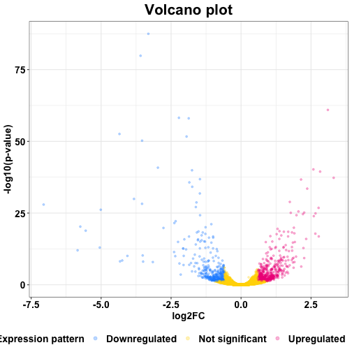

MyDEAr - My Differential Expression Analysis in R
========================================================
author: Krzysztof Kolmus 
date: 2020-05-02
autosize: true

Shiny app description
========================================================

**MyDEAr** *(My Differential Expression Analysis in R)* is designed for interactive exploration of high-throughput biological data sets from bulk RNA-sequencing experiments. It enables simultaneous arrangement and visualisation of experimental data. Dataset for MyDEAr was simulated based on the "airway" and "DESeq2" packages from Bioconductor to illustrate the principles of differential expression analysis.

* The app can be found here: https://krzysztof-kolmus.shinyapps.io/mydear_developingdataproducts/
* The code for this app can be found here: https://github.com/kkolmus/MyDEAr_DevelopingDataProducts/blob/master/app.R

Data
========================================================
The data used for this app were simulated using the "airway" and "DESeq2" packages from Bioconductor. <br />
<br />
Columns are:
  1. Gene name
  2. Alternative gene name
  3. Fold change ratio after differential expression analysis for positive control condition normalized   against control condition
  4. P-value for positive control condition normalized against control condition after differential expression analysis 
  5. Fold change ratio for treatment condition normalized against control condition
  6. P-value for treatment condition normalized against control condition after differential expression analysis


```r
exp.data.frame <- readRDS("exp.data.frame.RDS")
str(exp.data.frame)
```

```
'data.frame':	64102 obs. of  6 variables:
 $ GeneName        : chr  "GeneName1" "GeneName2" "GeneName3" "GeneName4" ...
 $ Alt.GeneName    : chr  "Alt.GeneName1" "Alt.GeneName2" "Alt.GeneName3" "Alt.GeneName4" ...
 $ Control_log2FC  : num  -0.3742 NA 0.2021 0.0362 -0.0845 ...
 $ Control_pval.adj: num  0.00128 NA 0.19655 0.91146 0.89503 ...
 $ Treated_log2FC  : num  0.2902 NA -0.0506 0.0147 0.1989 ...
 $ Treated_pval.adj: num  0.22 NA 0.939 0.99 0.855 ...
```


Data arrangement
========================================================
The MyDEAr app arranges the sample data based on fold change ratio and p-value.

```r
suppressPackageStartupMessages(library(tidyverse))
exp.data.frame <- readRDS("exp.data.frame.RDS")[,-c(3,4)]
# show unarranged data
head(exp.data.frame)
```

```
   GeneName  Alt.GeneName Treated_log2FC Treated_pval.adj
1 GeneName1 Alt.GeneName1     0.29018323        0.2201905
2 GeneName2 Alt.GeneName2             NA               NA
3 GeneName3 Alt.GeneName3    -0.05060086        0.9390635
4 GeneName4 Alt.GeneName4     0.01470465        0.9903670
5 GeneName5 Alt.GeneName5     0.19893617        0.8548322
6 GeneName6 Alt.GeneName6     0.00000000               NA
```

```r
exp.data.frame.arranged <- arrange(exp.data.frame, 
                                   exp.data.frame$Treated_log2FC,
                                   exp.data.frame$Treated_pval.adj)
# show arranged data
head(exp.data.frame.arranged)
```

```
       GeneName      Alt.GeneName Treated_log2FC Treated_pval.adj
1  GeneName6234  Alt.GeneName6234      -7.054757     1.097489e-28
2  GeneName4320  Alt.GeneName4320      -5.840621     9.513718e-13
3  GeneName1004  Alt.GeneName1004      -5.743904     5.364938e-21
4   GeneName325   Alt.GeneName325      -5.551535     1.383234e-19
5  GeneName6433  Alt.GeneName6433      -5.048775     1.080989e-13
6 GeneName41313 Alt.GeneName41313      -5.012805     6.975548e-27
```

Data classification
========================================================
The MyDEAr app classifies genes as either up- or down-regulated based on user defined thresholds.


```r
exp.data.frame <- readRDS("exp.data.frame.RDS")[,-c(3,4)]
UP = 0.6; DOWN = -0.6; pval = 0.05
exp.data.frame$Threshold <- ifelse(test = exp.data.frame$Treated_log2FC >= UP &
                                     exp.data.frame$Treated_pval.adj < pval, 
                                   yes = "Upregulated", 
                                   ifelse(exp.data.frame$Treated_log2FC <= DOWN &
                                            exp.data.frame$Treated_pval.adj < pval,
                                          yes = "Downregulated", no = "Not significant"))
# show classified data
head(exp.data.frame)
```

```
   GeneName  Alt.GeneName Treated_log2FC Treated_pval.adj       Threshold
1 GeneName1 Alt.GeneName1     0.29018323        0.2201905 Not significant
2 GeneName2 Alt.GeneName2             NA               NA            <NA>
3 GeneName3 Alt.GeneName3    -0.05060086        0.9390635 Not significant
4 GeneName4 Alt.GeneName4     0.01470465        0.9903670 Not significant
5 GeneName5 Alt.GeneName5     0.19893617        0.8548322 Not significant
6 GeneName6 Alt.GeneName6     0.00000000               NA Not significant
```


Data visualization
========================================================
The MyDEAr app visualizes the output of classification using a special kind of scatter plot called volcano plot. <br />
* The X axis shows the -log10 of p-values. <br />
* The Y axis shows the log2 of fold change ratio between condition of interest and normalization condition. <br />
* Each dot is a gene.<br />
* Legend shows the results of classification.<br />


